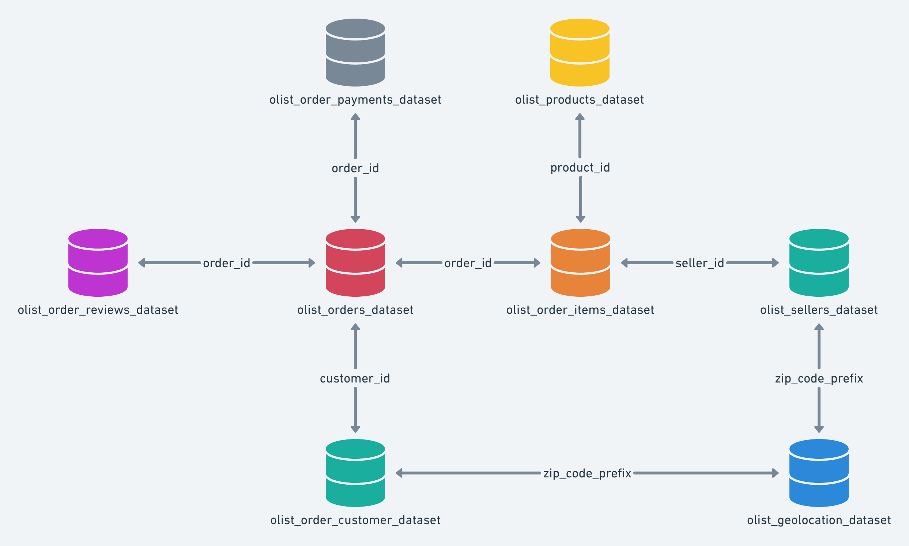

# Olist E-Commerce Data Pipeline (End-to-End ELT)

## Project Goal
This project builds an automated system to turn raw Brazilian e-commerce data into a clean, organized **Star Schema.** This setup makes it easy for businesses to analyze sales, track shipping performance, and understand customer behavior.

## About Dataset
This project utilizes a public dataset from the Olist Store, the largest department store in Brazilian marketplaces.
- **Scope:** Includes 100,000 orders made between 2016 and 2018 across multiple marketplaces in Brazil.
- **Features:** Provides a multidimensional view of e-commerce operations, including order status, pricing, payment history, and freight performance.
- **Customer Insights:** Contains detailed customer locations, product attributes, and customer reviews.
- **Geolocation:** Includes a dataset linking Brazilian zip codes to latitude and longitude coordinates for spatial analysis.

## How it Works (Architecture)
The pipeline uses a modern "ELT" (Extract, Load, Transform) approach:
- **Ingestion:** Automatically pulls raw data files into a PostgreSQL database.
- **Transformation:** Uses dbt to clean the data and organize it into a Fact table (for numbers) and Dimension tables (for details).
- **Orchestration:** Airflow acts as the "brain," running the whole process on a daily schedule and making sure each step finishes before the next begins.

## Key dbt Models

- **Fact**
  -  `fct_sales`
  -  Grain: One row per order item. Includes pricing, freight, logistics lead times, and satisfaction scores.

- **Dimension**
  - `dim_products`
  - Product specifications merged with English category translations.

- **Dimension**
  - `dim_customers`
  - Unique customer profiles with geographic and geolocation data.

- **Dimension**
  - `dim_sellers`
  - Seller identification and geographic performance attributes.

- **Dimension**
  - `dim_date`
  - A reference table for daily, monthly, and quarterly temporal analysis.

## Airflow Orchestration
The pipeline uses two specialized DAGs to handle data movement and transformation separately, providing both flexibility and automation.
The pipeline uses two specialized DAGs to handle data movement and transformation separately, providing both flexibility and automation.

1. **Data Ingestion DAG** (`olist_data_ingestion`)
This DAG is designed for the initial "Load" phase of the ELT process.
- **Dynamic Task Generation:** It scans the `/data` directory and creates an individual ingestion task for every CSV file it finds.
- **Python Integration:** It uses the `PythonOperator` to directly call the `load_csv_to_postgres` function from custom ingestion logic.
- **Manual Control:** It is set to `schedule_interval=None`, allowing to trigger a fresh data load manually whenever new source files arrive.

2. **Master Pipeline DAG** (`olist_ecommerce_transformation`)
This is the main "Orchestrator" that automates the end-to-end flow on a daily basis.
- **Scheduled Automation**: Runs on a `@daily` schedule to ensure the analytics layer is always up to date.
- **Unified Workflow:** It sequences three critical steps using the `BashOperator`:
  - **Ingestion:** Runs the core Python ingestion script to refresh raw data.
  - **dbt Run:** Executes `dbt run` to rebuild the Star Schema (staging, dimensions, and facts).
  - **dbt Test:** Executes `dbt test` as a final gatekeeper to validate data quality.
- **Fail-Fast Logic:** The tasks are linked (`ingest >> run >> test`), meaning if the ingestion or transformation fails, the pipeline stops immediately to protect the integrity of the dashboard data.

## Dashboard

## Challenges Overcome
- **Data Cleaning:** Fixed issues with duplicate records and inconsistent formatting in the original source files.
- **System Harmony:** Successfully connected different tools (Postgres, dbt, and Airflow) inside a containerized environment to work together smoothly.
- **Access Management:** Resolved technical hurdles regarding file permissions to allow the automated system to write its own logs and reports.
